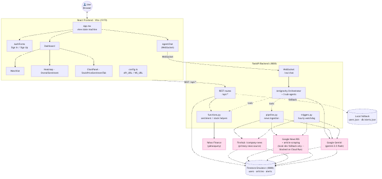

# MarketWave AI: Autonomous Financial News Monitoring & Multi-Agent Sentiment Engine



**MarketWave AI** is an intelligent, agentic market research and financial monitoring platform powered by **Google Gemini** and the **Google Antigravity SDK (`google-antigravity`)**. 

It continuously ingests live market-moving news, performs structured 18-topic sentiment analysis, correlates multi-dimensional sentiment trajectories against real historical stock candles (OHLCV), and coordinates a specialized multi-agent hierarchy with real-time reasoning thoughts streamed to the user interface.

---

## 🌟 Key Features

- 🤖 **Autonomous Multi-Agent Architecture**: Orchestrated via Google Antigravity SDK (`google-antigravity`), deploying specialized agents (`OrchestratorAgent`, `ResearchAgent`, `SentimentAnalyst`, `MarketCorrelator`).
- 🧠 **18-Topic Structured Sentiment Scoring**: Strict Pydantic schema enforcement (`TopicSentimentSchema`) rating 18 granular financial topics (`layoffs`, `revenue_growth`, `product_launches`, `mergers`, `esg`, `board_changes`, etc.) on a normalized `[-1.0, 1.0]` scale, with `null` for unmentioned topics to eliminate hallucinated zero-scores.
- 📈 **Stock Price vs. Sentiment Overlay Charts**: Synchronizes Yahoo Finance historical OHLCV price series with daily aggregated topic sentiment histograms on a dual-axis interactive chart.
- ⚡ **Real-Time Thought & Token Streaming**: WebSocket endpoint (`/ws/chat`) streams live agent reasoning thoughts (`{type: "thought"}`) to an expandable log drawer before streaming synthesis tokens (`{type: "token"}`).
- 🛰️ **Live Ingestion Activity Broadcaster**: WebSocket channel (`/ws/ingest`) broadcasts ingestion status (fetching, cleaning, scoring, saving) live to the dashboard.
- ⏰ **Proactive Sentiment Watchdog**: Hourly autonomous trigger (`backend/agents/triggers.py`) monitors user watchlists for severe negative sentiment drops (`< -0.5`) and generates alert notifications.
- 🔒 **User Authentication**: Secure PBKDF2 HMAC-SHA256 email/password login and **Google Sign-In** (OAuth 2.0 ID token verification).
- 💳 **3-Tier Monetization & Payments**: Built-in Razorpay integration (`Starter ₹0`, `Pro Trader ₹159/mo`, `Enterprise ₹299/mo`) with server-side HMAC-SHA256 signature verification.
- ☁️ **Resilient Cloud & Local Persistence**: Backed by **Google Cloud Firestore** in production with zero-config local emulation and fallback JSON stores (`users.json`, `alerts.json`, `orders.json`, `feedback.json`).

---

## 🏗️ Multi-Agent Hierarchy

MarketWave separates market intelligence into distinct, coordinated agent personas:

| Agent | Core Responsibility | Tools & Capabilities |
| :--- | :--- | :--- |
| **`OrchestratorAgent`** | Root coordinator; decomposes user queries, plans multi-step execution, sequentially delegates tasks, and streams reasoning logs | Sub-agent delegation, guardrails, policy enforcement |
| **`ResearchAgent`** | Discovers per-ticker company news, scrapes clean body text, and removes ads/boilerplate | `fetch_news_tool` (Finnhub API / Google News fallback) |
| **`SentimentAnalyst`** | Scores raw text against 18 financial categories with mathematical precision | `TopicSentimentSchema` structured schema constraint |
| **`MarketCorrelator`** | Fetches OHLCV market series and correlates price breakouts/drawdowns with sentiment shifts | `get_stock_history_tool` (YahooQuery) |

---

## 📊 18-Topic Financial Sentiment Taxonomy

Each ingested article is evaluated across 18 distinct financial dimensions:

| Category | Topics |
| :--- | :--- |
| **Corporate Operations** | `layoffs`, `restructuring`, `board_changes`, `labor_issues`, `expansion` |
| **Growth & Performance** | `revenue_growth`, `product_launches`, `mergers`, `partnerships`, `investor_activity` |
| **Risks & Macro** | `macro_economic`, `geo_political`, `disputes`, `cyber_security`, `supply_chain`, `product_recalls` |
| **Sustainability & Net** | `esg`, `overall_sentiment` |

---

## 💻 Tech Stack

- **Frontend**: React 19, TypeScript, Vite, Tailwind CSS, Recharts, Lucide Icons
- **Backend**: FastAPI, Uvicorn, WebSockets, Pydantic v2
- **Agentic Runtime & LLM**: Google Antigravity SDK (`google-antigravity`), Google Gemini (`gemini-2.5-flash` / `gemini-3.5-flash`), `google-genai`
- **Market Data & Ingestion**: Finnhub `/company-news` (primary), YahooQuery (stock price candles), BeautifulSoup4, Google News RSS decoder (fallback)
- **Database & Cloud**: Google Cloud Firestore, Firebase Hosting, Google Cloud Run
- **Payments & Auth**: Razorpay Payment API & HMAC SHA-256 verifier, Google OAuth 2.0

---

## 🚀 Quickstart & Local Setup

### 1. Clone & Prepare Virtual Environment
```bash
git clone https://github.com/mathamatigician/MarketWave.git
cd MarketWave

python3 -m venv .venv
source .venv/bin/activate
```

### 2. Install Dependencies
```bash
make install
```
*(Or manually: `pip install -r backend/requirements.txt && cd frontend && npm install && cd ..`)*

### 3. Configure Environment Variables
Copy the example environment files:
```bash
cp .env.example .env
cp .env.example.frontend frontend/.env
```

Edit `.env` and supply your API keys:
```env
GEMINI_API_KEY=your_gemini_api_key_here
FINHUB_API_KEY=your_finnhub_api_key_here
ADMIN_KEY=your_secure_admin_secret
AGENT_MODEL=gemini-2.5-flash

# Firestore (Defaults to local emulator; see .env.example for cloud mode)
FIRESTORE_PROJECT_ID=marketwave-demo
FIRESTORE_EMULATOR_HOST=localhost:8080

# Razorpay Test Keys (optional for payment testing)
RAZORPAY_KEY_ID=rzp_test_your_key_id
RAZORPAY_KEY_SECRET=your_test_key_secret
```

### 4. Start All Services
```bash
make start
# Or execute: ./start.sh
```

| Service | Access URL |
| :--- | :--- |
| **MarketWave Web UI** | `http://localhost:5173` |
| **FastAPI Backend & Swagger Docs** | `http://localhost:8000/docs` |
| **Firestore Local Emulator Console** | `http://localhost:4000` |

To stop all background services:
```bash
make stop
# Or execute: ./stop.sh
```

---

## 🛠️ Individual Dev Commands

Run `make help` to see all available targets:

- `make dev-backend` — Start FastAPI backend with hot-reload on port 8000.
- `make dev-frontend` — Start React Vite dev server on port 5173.
- `make dev-emulator` — Start Google Cloud Firestore local emulator.
- `make test-api` — Verify Firestore integration test.
- `make clean` — Clean `__pycache__` and compiled artifacts.

---

## 🌐 Google Cloud Platform (GCP) Deployment

MarketWave is architected for serverless scale-to-zero deployment on **Google Cloud Run**:

1. **Cloud Firestore**:
   Remove `FIRESTORE_EMULATOR_HOST` in `.env` and specify your real GCP project ID:
   ```env
   FIRESTORE_PROJECT_ID=your-gcp-project-id
   ```
   Authenticate using Application Default Credentials:
   ```bash
   gcloud auth application-default login
   ```

2. **Container Build & Deploy**:
   Build and deploy backend & frontend containers using Google Cloud Build / Cloud Run:
   ```bash
   gcloud run deploy marketwave-backend --source ./backend --region us-central1 --allow-unauthenticated
   ```

---

## 🧪 Testing

Run backend unit and integration test suites:
```bash
python3 -m unittest discover -s backend -p "test_*.py"
python3 -m unittest tests/test_agentic_flow.py
```

---

## 📁 Repository Structure

```
MarketWave/
├── backend/
│   ├── agents/
│   │   ├── orchestrator.py      # Orchestrator & sub-agent configurations
│   │   ├── tools.py             # Agent tools (news fetcher, stock history)
│   │   └── triggers.py          # Hourly autonomous watchdog trigger
│   ├── config.py                # Pydantic Settings & environment parsing
│   ├── database.py              # Cloud Firestore & fallback JSON persistence
│   ├── functions.py             # Stock metrics, aggregations & password hashers
│   ├── google_auth.py           # Google Sign-In ID token verification
│   ├── main.py                  # FastAPI REST endpoints & WebSocket handlers
│   ├── pipeline.py              # Ingestion, scraping & 18-topic sentiment scoring
│   ├── subscription.py          # Razorpay payment orders & signature checks
│   └── requirements.txt         # Python dependencies
├── frontend/
│   ├── src/
│   │   ├── components/
│   │   │   ├── AgentChat.tsx              # Copilot with real-time thought log drawer
│   │   │   ├── AuthForms.tsx              # Login & signup with Google Auth
│   │   │   ├── Dashboard.tsx              # Main sentiment intelligence dashboard
│   │   │   ├── DataWidgets.tsx            # Sector heatmap & top movers
│   │   │   ├── Heatmap.tsx                # 18-topic sentiment matrix table
│   │   │   ├── IngestActivity.tsx         # Live ingestion activity broadcaster
│   │   │   ├── OverallSentiment.tsx       # Market gauge meter
│   │   │   ├── StockPriceSentimentTab.tsx # Composed price & sentiment chart
│   │   │   ├── SubscriptionModal.tsx      # Razorpay payment modal
│   │   │   └── Watchlist.tsx              # Watchlist manager
│   │   ├── App.tsx                        # Root application & routing
│   │   ├── config.ts                      # Frontend environment config
│   │   └── types.ts                       # Shared TypeScript interfaces
│   └── package.json
├── databricks_notebooks/        # Scraper, Sentiment & RAG notebooks
├── docs/                        # Architecture specs & flow diagrams
├── tests/                       # End-to-end integration tests
├── Makefile                     # Build & run automation
├── start.sh                     # Service startup script
├── stop.sh                      # Service shutdown script
└── README.md
```

---

## 📄 License & Attribution

Built for the **Google Gemini & Antigravity Agent Hackathon**. Powered by Google Gemini and Google Antigravity SDK.
